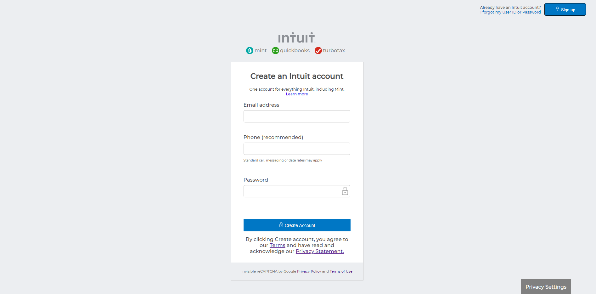

# Sign Up page Clone

> A signup page clone from mint.

This project consists of building an HTML document that matches the appearance of mint.com’s signup page.

## Built With

- HTML/CSS,
- VSSTUDIO CODE,
- git

## Live Demo

[Live Demo Link](https://raw.githack.com/rgcavalheiro/signup-page/signup_page_clone/index.html)

## Authors

👤 **Mateo mojica**

-Github: @mateomh
-Twitter: [@Mateom77199196]
-LinkedIn: http://linkedin.com/in/mateo-mojica-hernandez

👤 **Rafael Cavalheiro**

-Github: @rgcavalheiro
-Twitter: [@rgcavalheiro]
-LinkedIn: http://linkedin.com/in/rafael-cavalheiro-00415b94

## Show your support

Give a ⭐️ if you like this project!

## 📝 License

This project is [MIT](lic.url) licensed.